**Конфигурация и платформа проекта**

| Debug   | AnyCPU |
|:--------|:-------|
| Release | AnyCPU |

**Руководство пользователя**

Приложение «OutlookCalendarSynchronizer» работает в связке с приложением «TestHttpsOutlockServer». Для корректной работы приложений необходимо установить самоподписной сертификат. Данное руководство разбито на две части:

- Серверная часть

- Клиентская часть

В серверной части описано создание самоподписного сертификата и его экспорт, в клиентской части описано импорт серверного самоподписного сертификата. **Обратите внимание если приложения «OutlookCalendarSynchronizer» и «TestHttpsOutlockServer» запускаться на одной машине, то руководство пользователя для серверной части и для клиентской части должно быть выполнены на одной машине.**

***Серверная часть:***

1)  Откройте PowerShell с правами администратора.

2)  Создайте самоподписной сертификат, указав статический IP-адрес или «localhost» (если приложения «TestHttpsOutlockServer» и «OutlookCalendarSynchronizer» находятся на разных машинах, укажите статический IP-адрес, машины на которой находиться приложение «TestHttpsOutlockServer»):

| PowerShell |
|:---|
| New-SelfSignedCertificate -DnsName "localhost" -CertStoreLocation "cert:\LocalMachine\My" -NotAfter (Get-Date).AddYears(5) -KeyAlgorithm RSA -KeyLength 2048 -HashAlgorithm SHA256 -KeyExportPolicy Exportable -Provider "Microsoft Enhanced RSA and AES Cryptographic Provider" |

3)  Получите «App ID»:

| PowerShell                     |
|:-------------------------------|
| \[guid\]::NewGuid().ToString() |

4)  Настройте «netsh» для использования сертификата:

| PowerShell |
|:---|
| netsh http add sslcert ipport=0.0.0.0:8080 certhash=\<Thumbprint\> appid="{\<Your-App-ID\>}" |

5)  Пример выполнения команд в PowerShell:

> 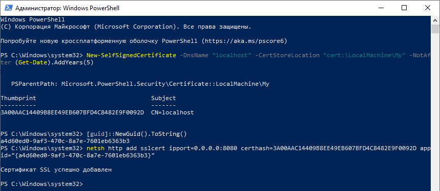

6)  Далее экспортируйте самоподписной сертификат, для этого откройте «mmc»:

> 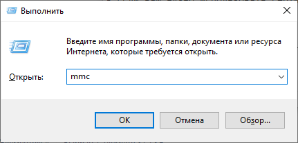

7)  Добавьте оснастку «Сертификаты»:

> 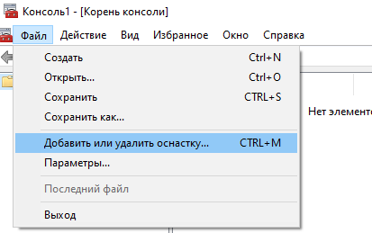
>
> 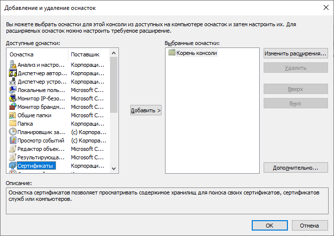
>
> 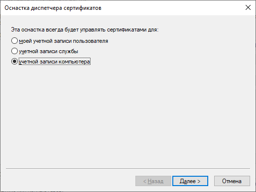
>
> 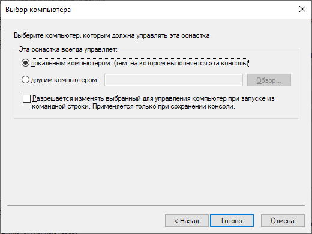

8)  Перейдите в «Сертификаты (локальный компьютер)» -\> «Личное» -\> «Сертификаты» и экспортируйте сертификат:

> 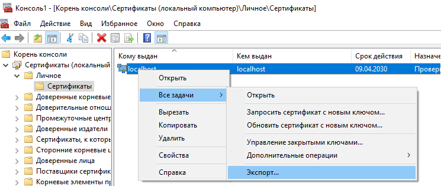

9)  В «Мастер экспорта сертификатов», выберите «Нет, не экспортировать закрытый ключ» -\> «Файлы Х.509 (.CER) в кодировке DER» -\> «Укажите путь для сохранения сертификата»

> 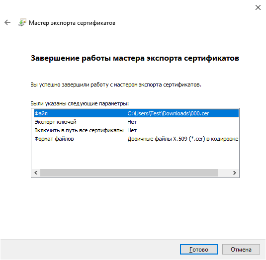

***Клиентская часть:***

1)  Для импорта серверного самоподписного сертификата, откройте «mmc»:

> 

2)  Добавьте оснастку «Сертификаты»:

> 
>
> 
>
> 
>
> 

3)  Перейдите в «Сертификаты (локальный компьютер)» -\> «Доверенные корневые центры сертификации» -\> «Сертификаты» и импортируйте сертификат следуя инструкциям «Мастер импорта сертификатов»

> 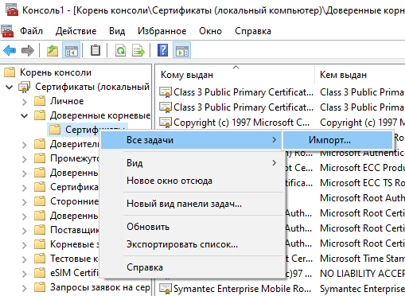
>
> 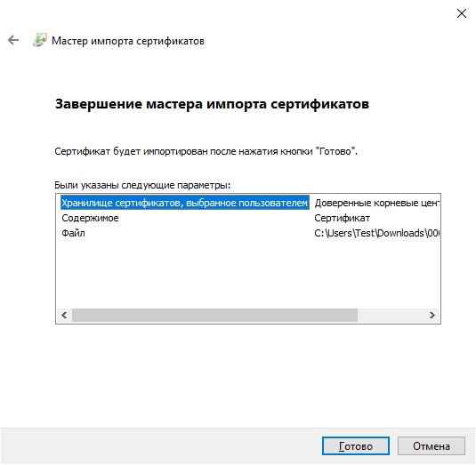

После проделанных действий запустите приложение «TestHttpsOutlockServer» и введите префикс для сервера (например, <https://localhost:8080/>). Для приложения «OutlookCalendarSynchronizer», введите «Учётную запись» и «URL-адрес сервера» (например, <https://localhost:8080/>):

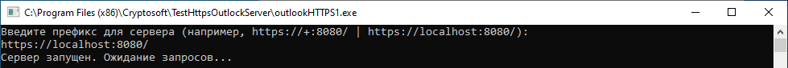

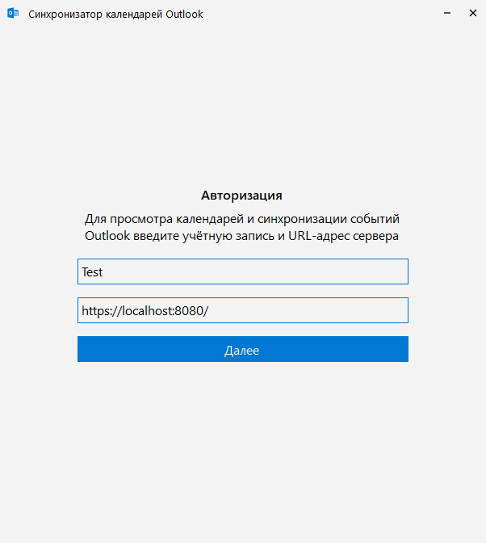
